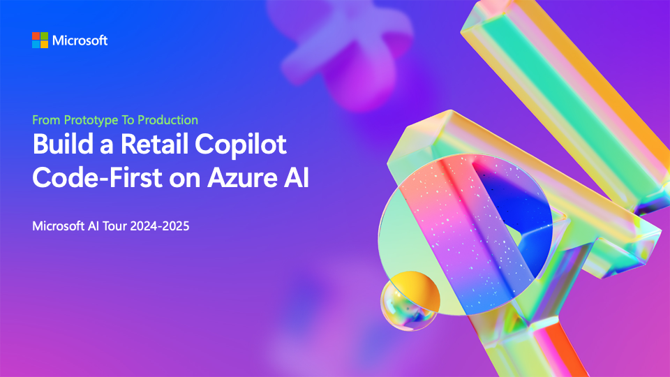

# Build a Retail Copilot Code-First on Azure AI

_This repository is a companion to the WRK550 workshop session offered on the 2024-2025 iteration of the Microsoft AI Tour, a worldwide tour of events. [Register to attend an event near you](https://aka.ms/aitour)!_ 

---

## Session Description

In this workshop, attendees will be introduced to the concept of GenAIOps, and learn to build a custom RAG-based retail copilot end-to-end, _code-first_ on the Azure AI platform.

Using the provided sample, attendees will learn to prototype, evaluate and deploy a customer support chat AI for _Contoso Outdoors_ - a fictitious retailer who sells hiking and camping equipment online. The sample uses a Retrieval Augmented Generation (RAG) architecture to implement a retail copilot solution that responds to customer queries with answers grounded in the retailer's product catalog and customer purchase history. 

## Application Architecture

Attendees will also learn the components of an Azure AI application architecture for implementing a custom copilot solution. User input ("question") to a frontend chat UI or client is sent to a hosted copilot endpoint on Azure Container Apps. The query is then routed to various processing services in an orchestrated RAG workflow that generates the relevant response - which is returned to the user through the frontend client.

The orchestration involves three processing services. The _Azure AI Search service_ manages product indexes for the retailer's catalog, returning matching items for user queries based on similarity search and semantic ranking. The _Azure CosmosDB service_ maintains a noSQL database with customer order history, returning product recommendations based on prior purchases. The _Azure OpenAI service_ manages model deployments for embeddings, chat and evaluation - key capabilities required to implement the query vectortization, response generation, and quality assessment steps of our end-to-end application lifecycle.

## Learning Outcomes

Implement a RAG-based copilot end-to-end with Prompty and Azure AI Studio

* Understand the RAG design pattern and Azure AI app architecture
* Provision and manage Azure infrastructure using _azd_-enabled AI templates
* Ideate and iterate on the application prototype using Prompty assets and tooling
* Evaluate and trace application execution for observability in cost and performance
* Deploy the custom copilot to Azure Container Apps for real-world usage
* Customize the sample with your data and extend it to meet your app scenariosx

## Technology Used

> [!IMPORTANT]  
> The table lists all the tools and technologies used in the Contoso Chat sample. It is under active development and features some tools that are in preview - so anticipate regular updates.

| Focus | Technology |
|:---|:---|
| Development Environment | GitHub Codespaces, Python 3, Visual Studio Code (IDE)|
| Chat AI - Backend App | Prompty, FastAPI, Docker container |
| Chat UI - Frontend App | Next.js, Node.js, npm (in _Contoso Web_) |
| Azure Infra Provisioning | Azure CLI, Azure Developer CLI, Bicep template |
| Azure Resources (AI) | Azure AI hub, Azure AI project, Azure Open AI service|
| Azure Resources (other) | Azure AI Search, Azure CosmosDB, Azure Container Apps |
| Azure OpenAI Models | gpt-35-turbo, gpt-4, text-embedding-ada002|
| Observability | Prompty Tracing, Azure App Insights, Open Telemetry|
| Automation (CI/CD) | GitHub Actions |
| | |

## Additional Resources and Continued Learning

> [!TIP]
> If you are a workshop instructor or proctors, start with the [**session delivery resources**](./session-delivery-resources/README.md).

| Resources          | Links                             | Description        |
|:-------------------|:----------------------------------|:-------------------|
| **Open-Source Samples** | [Contoso Chat](https://github.com/Azure-Samples/contoso-chat) · [Contoso Web](https://github.com/Azure-Samples/contoso-web) | Open-source repos with chat AI (backend) and web UI (frontend) samples used in the workshop. |
| **Prompty** |  [Docs](https://prompty.ai/)  · [Extension](https://marketplace.visualstudio.com/items?itemName=ms-toolsai.prompty) · [Package](https://pypi.org/project/prompty/) | New asset class that brings flexibility, observability, portability and understandability to the prompt engineering and ideation phase of app development. _Currently in preview_. |
| **Azure AI Templates** | [Curated Collection](https://aka.ms/azd-ai-templates) | Curated collection of Azure AI _azd templates_ that provide open-source samples for signature application scenarios using Azure AI and popular frameworks. Deployable with a single command!|
| **Azure AI Studio** | [Docs](https://learn.microsoft.com/en-us/azure/ai-studio/) · [SDK](https://learn.microsoft.com/azure/ai-studio/how-to/develop/sdk-overview) · [Model Catalog](https://ai.azure.com/explore/models) | Unified platform for building end-to-end generative AI applications on Azure. Explore the model catalog, deploy and manage models and applications, adopt responsible AI practices. |
| **Generative AI For Beginners** | [Open-Source Curriculum](https://aka.ms/genai-beginners) | Beginner-friendly open-source collection of lessons with hands-on projects to build up your knowledge of core concepts in prompt engineering, fine tuning, and more.|
| | | |

## Content Owners

<!-- ALL-CONTRIBUTORS-LIST:START - Do not remove or modify this section -->

<table>
    <tr>
        <td align="center">
            <a href="http://learnanalytics.microsoft.com">
                 
                <b>David Smith</b>
            </a> 
            <a href="https://www.linkedin.com/in/dmsmith/" title="linkedin">📢</a> 
        </td>
        <td align="center">
            <a href="http://learnanalytics.microsoft.com">
                 
                <b>Nitya Narasimhan, PhD</b>
            </a> 
            <a href="https://linkedin.com/in/nityan" title="talk">📢</a> 
        </td>
    </tr>
</table>

<!-- ALL-CONTRIBUTORS-LIST:END -->

## Responsible AI 

Microsoft is committed to helping our customers use our AI products responsibly, sharing our learnings, and building trust-based partnerships through tools like Transparency Notes and Impact Assessments. Many of these resources can be found at [https://aka.ms/RAI](https://aka.ms/RAI).
Microsoft’s approach to responsible AI is grounded in our AI principles of fairness, reliability and safety, privacy and security, inclusiveness, transparency, and accountability.

Large-scale natural language, image, and speech models - like the ones used in this sample - can potentially behave in ways that are unfair, unreliable, or offensive, in turn causing harms. Please consult the [Azure OpenAI service Transparency note](https://learn.microsoft.com/legal/cognitive-services/openai/transparency-note?tabs=text) to be informed about risks and limitations.

The recommended approach to mitigating these risks is to include a safety system in your architecture that can detect and prevent harmful behavior. [Azure AI Content Safety](https://learn.microsoft.com/azure/ai-services/content-safety/overview) provides an independent layer of protection, able to detect harmful user-generated and AI-generated content in applications and services. Azure AI Content Safety includes text and image APIs that allow you to detect material that is harmful. Within Azure AI Studio, the Content Safety service allows you to view, explore and try out sample code for detecting harmful content across different modalities. The following [quickstart documentation](https://learn.microsoft.com/azure/ai-services/content-safety/quickstart-text?tabs=visual-studio%2Clinux&pivots=programming-language-rest) guides you through making requests to the service.

Another aspect to take into account is the overall application performance. With multi-modal and multi-models applications, we consider performance to mean that the system performs as you and your users expect, including not generating harmful outputs. It's important to assess the performance of your overall application using [Performance and Quality and Risk and Safety evaluators](https://learn.microsoft.com/azure/ai-studio/concepts/evaluation-metrics-built-in). You also have the ability to create and evaluate with [custom evaluators](https://learn.microsoft.com/azure/ai-studio/how-to/develop/evaluate-sdk#custom-evaluators).

You can evaluate your AI application in your development environment using the [Azure AI Evaluation SDK](https://microsoft.github.io/promptflow/index.html). Given either a test dataset or a target, your generative AI application generations are quantitatively measured with built-in evaluators or custom evaluators of your choice. To get started with the azure ai evaluation sdk to evaluate your system, you can follow the [quickstart guide](https://learn.microsoft.com/azure/ai-studio/how-to/develop/flow-evaluate-sdk). Once you execute an evaluation run, you can [visualize the results in Azure AI Studio](https://learn.microsoft.com/azure/ai-studio/how-to/evaluate-flow-results).
