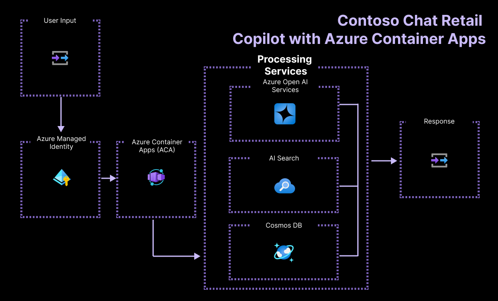
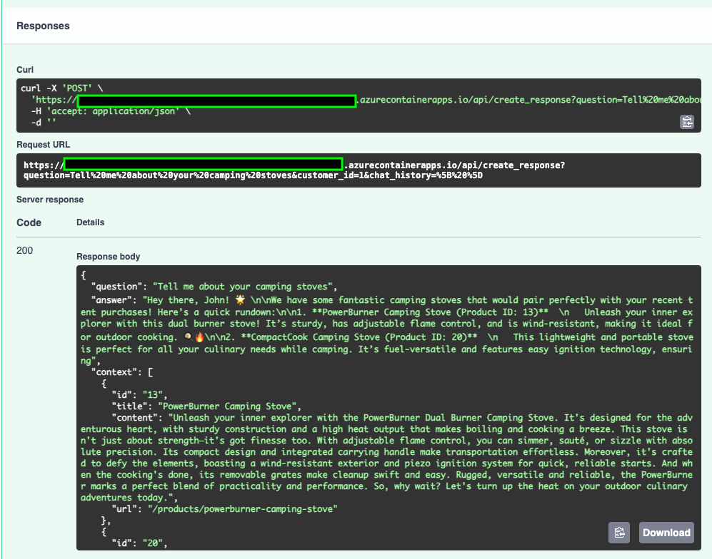

# 2.2 Skillable-Based Setup
**Welcome to the instructor-led workshop track on the Microsoft AI Tour!** This setup page is meant for attendees currently in the venue, working with a Skillable subscription.

!!! quote "ARE YOU REVISITING THE LAB AT HOME AFTER AITOUR? → [JUMP TO SELF-GUIDED SETUP PAGE](./../2-Provisioning/01-Self-Guided.md) instead"  

!!! info "IN-VENUE ATTENDEES: Before You Begin .."

    - Check that you have the Skillable Lab link. The instructor will have displayed it onscreen.
    - The instructor may ask you to wait till they give the signal to launch. Follow their lead.
    - Look around and note the proctors in the room. Raise your hand to get their help at any time.

---

## 1. Launch Skillable VM

Visit the Skillable Lab link provided to you by the instructor. You will see a page with the **WRK550** lab code and a Launch button. Click to launch the lab. _This takes a couple of minutes to load_.

You should see a screen similar to that in the screenshot below. 

!!! quote "THIS IS THE SKILLABLE LAB VM: It has a login screen (left) and instructions (right)."

    - [X] The page has a countdown timer (yellow highlight) - _use it to track time left in session_.
    - [X] The panel has a Lab Instructions section - _open the link provided in a new browser tab_.
    - [X] There's an Azure Credentials section (green highlight) - *verify that values are not empty*.
    - [X] There are Skillable VM credentials (red highlight) - *we won't need them* so don't log in here.

    !!! warning "DO NOT LOG INTO THE VM - we will be working in GitHub Codespaces instead."

    

!!! info "IMPORTANT: Leave this tab open in your browser. Closing it will automatically terminate your lab session"


**Congratulations!** Your Skillable VM is live!

---

## 2. Launch GitHub Codespaces

The repository is configured with a _devcontainer_ (defining the development environment) and GitHub Codespaces _prebuild_ that will launch almost instantly, with one click. Let's activate it.


### 2.1 Activate The Prebuild

1. Open a new browser tab and navigate to the link below. 

    ``` title="" linenums="0"
    https://aka.ms/contoso-chat/prebuild
    ```

    !!! info "**TIP**: Hover the mouse over the folder icon in the code block (right) to get a _Copy to clipboard_ option."

1. You may be prompted to log into GitHub first. **Use a personal GitHub account here**.
1. You will see a screen like this with values auto-selected for you. Click **Create codespace**.

    

1. You will see a new browser tab open with a VS Code editor load in less than a minute.
1. Wait till ready. You see a README.md window (editor pane) and an active cursor (terminal).
    
    !!! warning "**CLOSE THE README WINDOW inside the editor pane.** We won't need that today."

**Congratulations!** Your development environment is active!


### 2.2 Fork The Repo

The prebuild uses the _original repo_ but we want you to maintain a personal copy so you can make changes. This also gives you a sandbox you can revisit at home, to modify or complete at your own pace. We'll do this in two steps.

!!! tip "TIP: You will be running these commands inside GitHub Codespaces - in the active VS Code Terminal there." 

1. Run this command in terminal. Complete workflow. _You just logged in with GitHub CLI_.

    ```bash title="" linenums="0"
    GITHUB_TOKEN="" gh auth login --hostname github.com --git-protocol https --web --scopes workflow 
    ```

1. Next, run this command in terminal. _You just forked this repo into your personal profile_. 

    ``` title="" linenums="0"
    GITHUB_TOKEN="" gh repo fork --remote
    ```

    ??? quote "TROUBLESHOOTING: Expand this to see step-by-step guidance (with screenshots) - if needed"

        - Copy the code in the terminal. Press Enter to get the screen below, then paste the code in.

            

        - You will be taken to this confirmation screen. Click the "Authorize GitHub" button to proceed.

            

        - You can now return to the VS Code Terminal. You should see a successful login like this:

            

**Congratulations!** You now have a fork of the repo in your personal profile!

---

## 3. Authenticate with Azure

!!! warning "IMPORTANT: USE THE SKILLABLE PROVIDED AZURE CREDENTIALS FOR AUTHENTICATION. Do not use your own (personal or company) account."

We have an active development environment connected to our personal fork of the repo. Now it's time to configure it to talk to the Azure infrastructure we pre-provisioned for you. We'll use two different tools - `az` (Azure CLI) and `azd` (Azure Developer CLI). Let's log into both.


### 3.1 Azure CLI login

1. Run this command in terminal. Complete workflow when prompted. 

    !!! info "You will need the Azure Credentials (Username, password) from the Skillable VM tab for this step!"

    ``` title="" linenums="0"
    az login --use-device-code
    ```

1. You will have opened a new tab to complete auth workflow. You can close that now.
1. Return to GitHub Codespaces tab and VS Code terminal to continue.

### 3.2 Azure Developer CLI login

1. Run this command in terminal. Complete workflow when prompted. 

    !!! tip "TIP: You won't need to enter Azure credentials again - just select the account you logged into in the last step!"

    ``` title="" linenums="0"
    azd auth login --use-device-code
    ```


1. You will have opened a new tab to complete auth workflow. You can close that now.
1. Return to GitHub Codespaces tab and VS Code terminal to continue.

**Congratulations!** Your development environment is now connected to your Azure subscription.

---

## 4. Configure Env Variables

Your development environment contains the code for a working application. Your Azure subscription is pre-provisioned with required infrastructure. We need need to set those environment variables locally, for development. **The `azd` tool makes this easy**.

1. Run this command in the terminal. You should see a .azure/` folder created locally.

    ``` title="" linenums="0"
    azd env set AZURE_LOCATION francecentral -e AITOUR --no-prompt
    ``` 

1. Run this command, next. Select default subscription shown when prompted.

    ``` title="" linenums="0"
    azd env refresh -e AITOUR 
    ```

1. Open the Visual Studio Code file explorer. Look for the `.azure/AITOUR/.env` file
1. Open the file in the editor. You should see 20+ environment variables pre-populated

    !!! tip  "TIP: We use [Azure Managed Identities](https://learn.microsoft.com/entra/identity/managed-identities-azure-resources/overview) for keyless authentication as a _security best practice_. Note that the environment variables do not contain any API keys or credentials, reducing leakage of secrets." 

**Congratulations!** Your development environment is configured to use provisioned infrastructure.

---

## 5. Upload Your Data

!!! info "NOTE: This step is required only in the Skillable track and is automated for the Self-Guided option (different process)."

Retrieval Augemented Generation (RAG) requires us to ground AI responses in our data. In this step we upload the product catalog data to Azure AI Search - and create an index. We also upload the customer orders history to Azure CosmosDB - and create a database. Chat responses are now grounded in both sources.

**We do this in two steps. The entire process takes 2-3 minutes to complete**.

1. Run this command. This gives your user identity "write" access to those resources.

    ``` title="" linenums="0"
    bash ./docs/workshop/src/0-setup/azd-update-roles.sh
    ```

1. Run this command. This uploads the data and creates the index and database for you.

    ``` title="" linenums="0"
    azd hooks run postdeploy
    ```

**Congratulations!** You have a working application you can test now on Azure!

---

## 6. Test Your Application

Recall that we are building the chat AI part of Contoso Chat as shown in this architecture:



With this setup, we've deployed an Azure Container App that contains our working application, and we've populated the data that it will use for grounded responses. **Let's validate setup quickly!**.

### 6.1 View Deployed App

!!! tip "TIP: To validate deployment, we'll see if the Azure Container App is live with our heartbeat message."

1. Visit the link below in a browser tab → You should see `rg-AITOUR` listed.

    ```  title="" linenums="0"
    https://portal.azure.com/#browse/resourcegroups
    ```
    
1. Click the `rg-AITOUR` listing  → You should see the overview page as shown:

    

1. Verify that your resources were provisioned by looking for the highlighted areas:

    - There should be **35 deployments** (listed under _Essentials_ - area 1)
    - There should be **15 records** (listed in _Resources list_ - area 2)

1. Look for a **Container App** resource (under Type column)
    - Click that resource  → You'll see the Container App overview page
    - Look for an **Application Url** under _Essentials_  → Click that link
    - You should be taken to a page that has a message like this displayed:

        

**This is a "heartbeat" message** that confirms our chat AI app was deployed and is live!


### 6.2 Test Deployed App

!!! tip "TIP: To validate data is populated, we'll test our deployed API with a question."

1. Continue from previous step   → Note the page URL ends with `.azurecontainerapps.io`.
1. Append `/docs`  → The updated link will now end with `.azurecontainerapps.io/docs`.
1. Hit enter to navigate to _this_ new link  → This opens a Swagger page for testing as shown:

    

1. Click the down arrow on the POST section  → You will see a **Try it out** button.
1. Click this to make the fields below editable  → Then fill in this data.
    - Set question to:  `Tell me about your camping stoves`
    - Set customer id to: `1`
    - Set chat history to: `[ ]`
1. Click the blue Execute button to send the request with this data to that app endpoint.

    

1. In a few seconds, the **Responses** section will update (see Screenshot below). Verify:

    - You should see the **question** you posted
    - You should see a relevant **answer**.
    - You should see the retrieved **context** used to ground the response.
    - You see your application Url in the green-highlighted boxes.

    


!!! success "CONGRATULATIONS! You completed Provision & Setup - and validated your app works!"