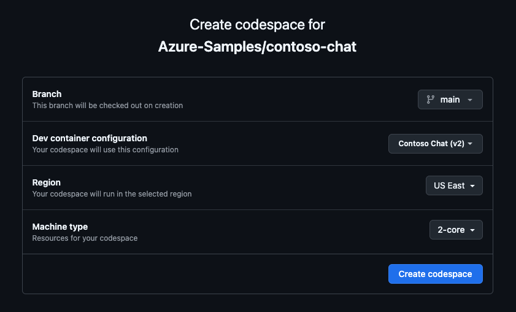

# 2.2 Skillable-Based Setup

This is the start of the instructor-led workshop track for Microsoft AI Tour attendees.

!!! quote "ARE YOU REVISITING THE LAB AT HOME AFTER AITOUR? → [JUMP TO SELF-GUIDED SETUP](./../2-Provisioning/01-Self-Guided.md) instead"  

---

## 1. Launch Skillable VM

Your instructor will have provided you the Skillable Lab link at the beginning of the session.  If you have not already done so, launch that Skillable lab now and wait till it completes loading. You should see something like this when ready.

!!! info "YOU WILL SEE A SKILLABLE VM LIKE THIS WHEN LOADING COMPLETES"

    

This is the Skillable environment which consists of a VM and an active Azure subscription that has been pre-provisioned with everything you need for this lab.

!!! warning "DO NOT LOG INTO THE VM - we will be working in GitHub Codespaces instead."

**Leave this Skillable tab open** - closing it will prematurely will terminate your lab session. Instead, take a minute to view the page and make note of the following information:

!!! quote ""

    - [X] There's a countdown timer (yellow highlight) - use it to track time left in session.
    - [X] There's a Lab Instructions link - click to open _this_ instruction guide in a new browser tab.
    - [X] There's an Azure Credentials section (green highlight) - verify that values are not empty.
    - [X] There are Skillable VM credentials (red highlight) - **ignore them** since we don't use the VM.


---

## 3. Launch GitHub Codespaces

The repository is configured with a _devcontainer_ that lets you get a predefined development environment with just a couple of clicks, using GitHub Codespaces. By using a **prebuild** image, we can speed up the launch time - so let's do that, next!

!!! info "**TIP**: Hover over the folder icon in code blocks to copy-paste"

    Codeblocks (or code fences) are blocks containing terminal commands or code snippets, used for illustration. These blocks will have a faint _folder_ icon at top right. Hover over it to get a "Copy to clipboard" option for efficient copy-paste tasks.

### 3.1 Activate The Prebuild

1. Open a new browser tab and navigate to the link below. If you were not already logged into GitHub, you will be prompted to do so now. **Use a personal GitHub account** to log in.

    ``` title="" linenums="0"
    https://aka.ms/contoso-chat/prebuild
    ```

1. You should see a screen like this. Your _Region_ selection may vary based on the current location. Click the **Create codespace** button to continue.

    

1. You will see a new browser tab open with a Visual Studio Code editor loading.
    - Wait for the page to complete loading (takes a few minutes)
    - You will see a VS Code terminal and a README file open in the editor.
    
    !!! warning "**CLOSE THE README view.** We will not be using those instructions today."

### 3.2 Fork The Repo

The prebuilt Codespaces is running on the original repo. In this step, we'll fork the repo to our personal profile. This gives us a personal copy that we can modify and revisit at home.

1. Open the VS Code Terminal and run this command. 

    ```bash title="" linenums="0"
    GITHUB_TOKEN="" gh auth login --hostname github.com --git-protocol https --web --scopes workflow 
    ```

1. Follow the prompts to complete auth flow. You can click to expand the section below to get a visual walkthrough of these steps with screenshots, if needed.

    ??? info "OPTIONAL: Expand to see the workflow  guidance with screenshots"

        - Copy the code in the terminal. Press Enter to get the screen below, then paste the code in.

            

        - You will be taken to this confirmation screen. Click the "Authorize GitHub" button to proceed.

            

        - You can now return to the VS Code Terminal. You should see a successful login like this:

            

1. Now run this command in the terminal to fork the repo to your personal profile. 

    ``` title="" linenums="0"
    GITHUB_TOKEN="" gh repo fork --remote
    ```

!!! success "CONGRATULATIONS. You have a personal fork of the repo in your profile!"

---

## 4. Authenticate with Azure

We will be using two different tools to work with Azure for provisioning. In this step, we'll authenticate with Azure through both tools to get them ready,

!!! warning "IMPORTANT: Do not use your personal credentials. Use the Azure Credentials from the Skillable VM page."

### 4.1 From Azure CLI

1. Log into the **Azure CLI** `az` using the command below. 

    ``` title="" linenums="0"
    az login --use-device-code
    ```

    -  Follow the prompts to complete the authentication workflow.
    -  Return to the VS Code terminal in GitHub Codespaces when done.

### 4.2 From Azure Developer CLI

1. Log into the **Azure Developer CLI** (`azd`) using the command below. 

    ``` title="" linenums="0"
    azd auth login --use-device-code
    ```

    - Follow the same process as before to complete the authentication workflow.
    - Note: Now you will just select the Skillable login from options (no password needed)


!!! success "CONGRATULATIONS. You are authenticated with Azure in both `az` and `azd` tools."

---

## 5. Configure Env Variables

Skillable has pre-provisioned your infrastructure. All you need to do now are update your local environment variables to reflect the deployments. Let's do this quickly, using `azd` as follows:

1. Run this command in your VS Code Terminal. You should see a `.azure/` folder created.

    ``` title="" linenums="0"
    azd env set AZURE_LOCATION francecentral -e AITOUR --no-prompt
    ``` 

1. Run this command next. Select the default Azure subscription when prompted.

    ``` title="" linenums="0"
    azd env refresh -e AITOUR 
    ```

1. This should have pulled down the Azure environment variables. Let's verify this
    
    - Open the `.azure/AITOUR/.env` file in your Visual Studio Code editor
    - Verify that it updated with environment variables (approx. 22 variables)

    !!! note  "We use  [Azure Managed Identities](https://learn.microsoft.com/entra/identity/managed-identities-azure-resources/overview) for keyless authentication as a _security best practice_. As a result, you should not see any API keys or credentials in this list." 

!!! success "CONGRATULATIONS. Your development environment is configured for your Azure AI project!"

---

## 6. Upload Your Data

!!! note "This step is required ONLY in Skillable environments since resources were pre-provisioned with a non-user identity. In the self-guided track, everything is done by the user with a single `azd up` command, including the data upload, so you are all set to ideate!"

Retrieval Augmented Generation (RAG) requires us to ground AI responses in our data. In this step, we upload our product and customer data to the Azure AI Search (index) and Azure AI CosmosDB (database) respectively. We'll complete the process in two steps:

1. _Step 1:_ Update resource roles to permit user access by running this command.

    ``` title="" linenums="0"
    bash ./docs/workshop/src/0-setup/azd-update-roles.sh
    ```


1. _Step 2:_ Then upload the data to those resources by running this command.

    ``` title="" linenums="0"
    azd hooks run postprovision
    ```

   
!!! success "CONGRATULATIONS. You populated the data and your Skillable setup is COMPLETE!"

---

