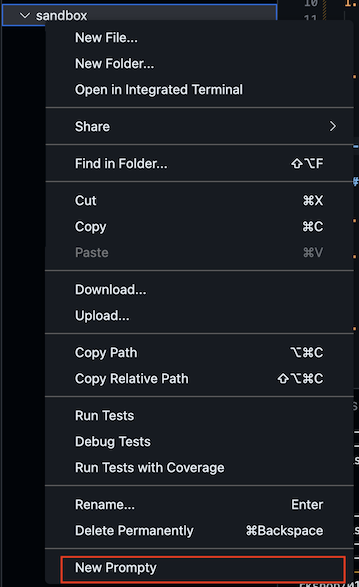
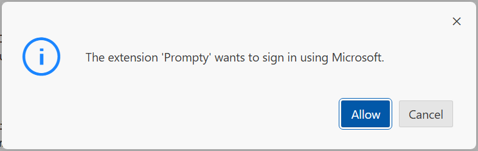

# 3.1 Create a New Prompty

!!! info "The GitHub Codespaces environment is already setup with the Prompty extension which helps us create, manage, and execute, these assets. Let's start with an empty sandbox and start ideation!"

---

## 1. Create Sandbox Folder

1. Open the VS Code terminal in GitHub Codespaces.
1. Run this command to create a new empty sandbox folder:
    ``` title="" linenums="0"
    mkdir sandbox
    ```
1. Open the File Explorer window in VS Code, and locate this folder!

---

## 2. Create New Prompty

1. Click on the `sandbox` folder name in the File Explorer
1. Click on the `New Prompty` option you will see in the dropdown menu, as shown

    

1. You should see a `basic.prompty` file created in that folder. 


## 3. Explore Prompty Asset

1. Open the `basic.prompty` asset in your VS Code Editor. 

    ??? info "(Click to expand) The `basic.prompty` asset should look like this:"

        ```yaml title="basic.prompty"
        ---
        name: ExamplePrompt
        description: A prompt that uses context to ground an incoming question
        authors:
            - Seth Juarez
        model:
            api: chat
            configuration:
                type: azure_openai
                azure_endpoint: ${env:AZURE_OPENAI_ENDPOINT}
                azure_deployment: <your-deployment>
                api_version: 2024-07-01-preview
            parameters:
                max_tokens: 3000
        sample:
            firstName: Seth
            context: >
                The Alpine Explorer Tent boasts a detachable divider for privacy, 
                numerous mesh windows and adjustable vents for ventilation, and 
                a waterproof design. It even has a built-in gear loft for storing 
                your outdoor essentials. In short, it's a blend of privacy, comfort, 
                and convenience, making it your second home in the heart of nature!
            question: What can you tell me about your tents?
        ---

        system:
        You are an AI assistant who helps people find information. As the assistant, 
        you answer questions briefly, succinctly, and in a personable manner using 
        markdown and even add some personal flair with appropriate emojis.

        # Customer
        You are helping {{firstName}} to find answers to their questions.
        Use their name to address them in your responses.

        # Context
        Use the following context to provide a more personalized response to {{firstName}}:
        {{context}}

        user:
        {{question}}
        ```

1. Let's see what the asset format contains:

    1. You see a YAML format with frontmatter (top) and content (bottom)
    1. The frontmatter has app metadata, model config parameters, and sample data
    1. The template contains a system message, document context, and instructions
    1. The sample provides inputs (e.g., user query) that map to template variables

1. This may feel familiar to you if you've used a model playground for prompt engineering. All we need now, is a runtime to execute the asset - generating a model response to the user question (provided in the sample).


## 4. Run The Prompty

We saw the Prompty tooling (to create asset) and the Prompty asset format (`.prompty` file). Now, we'll use the Prompty runtime for VS Code to execute the asset:

1. Open the `basic.prompty` file in the VS Code editor.
1. Click the _play icon_ seen at top-right corner (or press F5).
1. You will be prompted to sign in to your Azure account. Click `Allow`.

    

1. Select your Azure account when prompted and complete the auth flow.
1. This allows Prompty to use Managed Identity to access deployed model endpoints.
1. Your Prompty asset is executed - and the response displayed in the VS Code terminal.

!!! danger "NOTE: This step will fail with an error. Don't worry, that's expected."

Your Visual Studio Code terminal will switch to the "Output" tab and display this error:
> ❌ | ` Error: 404 The API deployment for this resource does not exist.`

We can see from _line 11_ of the prompty asset above, that the `azure-deployment` property  was not set! Let's fix that, next!

---

!!! success "CONGRATULATIONS. You created and ran your first Prompty!"

