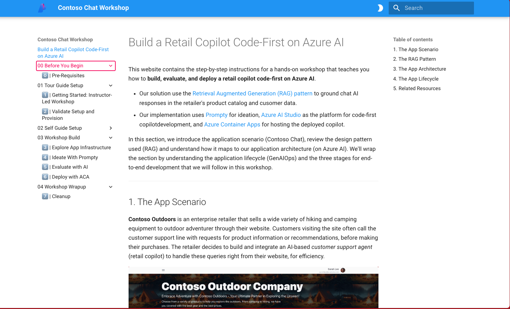

# Session folder

> [!NOTE]  
>  The Microsoft AI Tour is Live - [Register to attend](https://aka.ms/aitour) at a city near you!

This folder contains the public facing files for the lab `WRK550`.

## Build a Retail Copilot Code-First on Azure AI

These instructions are for participants of the Workshop "Build a Retail Copilot Code-First on Azure AI" at Microsoft AI Tour 2024-2025. The workshop is offered as an **instructor-led** session (WRK550) on the **Prototype to Production** track:

> In this workshop, attendees will be introduced to the concept of GenAIOps, and learn to build a custom RAG-based retail copilot end-to-end, _code-first_ on the Azure AI platform.
>
> Using the provided sample, attendees will learn to prototype, evaluate and deploy a customer support chat AI for _Contoso Outdoors_ - a fictitious retailer who sells hiking and camping equipment online. The sample uses a Retrieval Augmented Generation (RAG) architecture to implement a retail copilot solution that responds to customer queries with answers grounded in the retailer's product catalog and customer purchase history. 

- [**Register to attend**](https://aitour.microsoft.com/) at a tour stop near you.
- [**View Lab resources**](https://aka.ms/aitour/wrk550) to continue your journey.

If you're not a workshop participant at AI Tour, you can still visit [Azure-Samples/contoso-chat](https://github.com/Azure-Samples/contoso-chat) to explore the workshop **using your own Azure subscription**.
 - View the workshop instructions in the [`docs/workshop`](https://github.com/Azure-Samples/contoso-chat/tree/main/docs/workshop) folder
 - View a web preview of instructions at [https://aka.ms/aitour/contoso-chat/workshop/](https://aka.ms/aitour/contoso-chat/workshop)

## Pre-Requisites

To participate in the instructor-led workshop you will need the following:

1. **Your own laptop.** - It need only be capable of running a browser and GitHub Codespaces. We recommend using a recent version of the Edge, Chrome or Safari browser.
1. **A GitHub Account.** - You can [sign up for a free account](https://github.com/signup) if needed. Once you complete the workshop, you will have a personal fork of the sample (with workshop instructions) to continue exploring at home.
1. _recommended_: **Familiarity with Visual Studio Code.** - We will run all code in GitHub Codespaces and use VS Code Online as our primary development environment in it.
1. _preferred_: **Familiarity with the `bash` shell.** - We'll use it in the VS Code terminal for command-line execution of tasks and scripts, including for Azure CLI commands.
1. _preferred_: **Familiarity with Python and Jupyter Notebooks** - We'll be creating Python scripts and running them from the command line and from Notebooks.

> [!IMPORTANT]  
>  If you are working on this at home, using the **Self-Guided** option, you also need:

1. **Active Azure Subscription** - with access to the relevant resources and AI model deployments required for this workshop.
1. **Manual Provisioning Step** - you will need to provision the infrastructure yourself by manually running required commands (`azd up`).

 

## Get Started

To get started, you will need to:

1. launch the Skillable Lab (in the Microsoft AI Tour instructor-led session) to get access to the relevant Azure subscription credentials. 
1. fork the [contoso-chat](https://github.com/Azure-Samples/contoso-chat) sample (with branches) 
1. switch to the `aitour-WRK550` branch & launch GitHub Codespaces
1. then follow the workshop instructions as described below

## View Instructions

The workshop instructions are available in the repository under the [`docs/workshop`](https://github.com/Azure-Samples/contoso-chat/tree/main/docs/workshop/docs) folder as readable Markdown files. The content is authored in Markdown and is readable directly from source.

However, for convenience, you can use one of these two options to get a _rendered preview_ as shown below, which may be easier to navigate.

### **Option 1: View Online Preview**

Visit [https://aka.ms/aitour/contoso-chat/workshop](https://aka.ms/aitour/contoso-chat/workshop) in your browser, to see a hosted preview of this workshop guide. _We will keep this up to date for the duration of Microsoft AI Tour_.

### **Option 2: View Local Preview**

Once GitHub Codespaces is running on your fork of the repo, you can launch the preview locally using these 2 steps:
 - changing to the workshop directory in a terminal: `cd docs/workshop`
 - running the preview server: `mkdocs serve -a localhost:5000`

You will see a dialog pop-up with options to view this in browser or in VS Code.

 

## Continue The Workshop

You can now continue working through the instructions for the workshop, starting with the [Tour Guide Setup](https://github.com/Azure-Samples/contoso-chat/blob/main/docs/workshop/docs/01-Tour-Guide-Setup/01-setup.md) section. The figure below provides a high-level view of the developer workflow you will follow in this workshop.

 

## Discussions

Contoso Chat is an open source project supported by Microsoft. See the [SUPPORT.md](../SUPPORT.md) file for details on how to raise issues or contribute. 

> [!TIP]  
> If you enjoyed this workshop, please [give the repository a ⭐](https://aka.ms/aitour/contoso-chat), watch it for updates, and share it with others so we can help make this better for everyone!

## Additional Resources and Continued Learning

| Resources          | Links                             | Description        |
|:-------------------|:----------------------------------|:-------------------|
| **Open-Source Samples** | [Contoso Chat](https://github.com/Azure-Samples/contoso-chat) · [Contoso Web](https://github.com/Azure-Samples/contoso-web) | Open-source repos with chat AI (backend) and web UI (frontend) samples used in the workshop. |
| **Prompty** |  [Docs](https://prompty.ai/)  · [Extension](https://marketplace.visualstudio.com/items?itemName=ms-toolsai.prompty) · [Package](https://pypi.org/project/prompty/) | New asset class that brings flexibility, observability, portability and understandability to the prompt engineering and ideation phase of app development. _Currently in preview_. |
| **Azure AI Templates** | [Curated Collection](https://aka.ms/azd-ai-templates) | Curated collection of Azure AI _azd templates_ that provide open-source samples for signature application scenarios using Azure AI and popular frameworks. Deployable with a single command!|
| **Azure AI Studio** | [Docs](https://learn.microsoft.com/en-us/azure/ai-studio/) · [SDK](https://learn.microsoft.com/azure/ai-studio/how-to/develop/sdk-overview) · [Model Catalog](https://ai.azure.com/explore/models) | Unified platform for building end-to-end generative AI applications on Azure. Explore the model catalog, deploy and manage models and applications, adopt responsible AI practices. |
| **Generative AI For Beginners** | [Open-Source Curriculum](https://aka.ms/genai-beginners) | Beginner-friendly open-source collection of lessons with hands-on projects to build up your knowledge of core concepts in prompt engineering, fine tuning, and more.|
| | | |

## Source code

The source code for this session can be found in the [Contoso-Chat](https://aka.ms/aitour/contoso-chat) repo.
